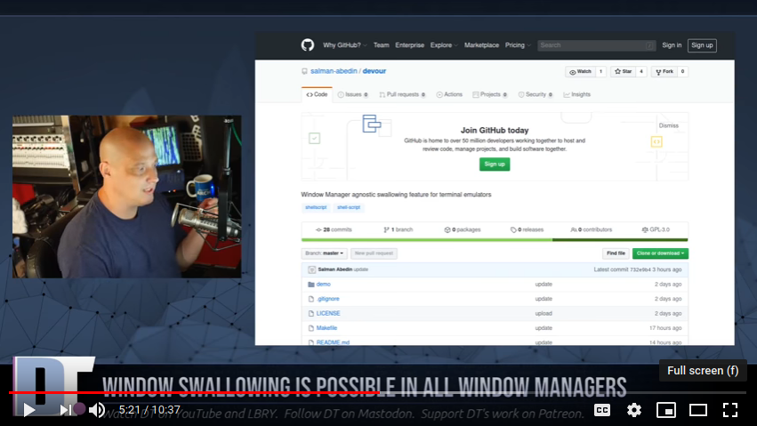

# Demonstration done by Distrotube

[](https://www.youtube.com/watch?v=mBNLzHcUtTo&t=5m22s&fbclid=IwAR3L2kyohAIOzuBkj1sZPg14b9OYhpiN43UE_Gg39FNtkHaV0ygklnRbqwE)

# Devour: Window Manager agnostic swallowing feature for terminal emulators

Devour hides your terminal window before launching an external program and unhides it after quitting.

Devour is the successor to
[BSPWM_Swallow](https://github.com/salman-abedin/bspwm_swallow)
and a fork of
[sw](https://github.com/ronniedroid/.dotfiles/blob/master/Scripts/sw) by
[ronniedroid](https://github.com/ronniedroid)

## Dependencies

-  [xdo](https://github.com/baskerville/xdo)

## Installation

```sh
git clone https://github.com/salman-abedin/devour.git && cd devour && sudo make install
```

## Usage

```sh
devour [CMD...]
```

## Pro Tip

**Devour from your file browser instead of the shell.**

Watch my demo and notice how seamless it is compared to devouring from the shell.

**Hint:** If you are one of those unfortunate souls who uses **xdg-open** instead of
[a custom launch script](https://gist.github.com/salman-abedin/6f52c52e465d89d489f9ea8d891c7332),
then go to your **~/.local/share/applications** directory and modify the applications you launch from your file browser like below and enjoy the true devouring experience.

```
[Desktop Entry]
Type=Application
Name=PDF Reader
Exec=/usr/local/bin/devour /usr/bin/zathura %U
```

## Uninstallation

```sh
sudo make uninstall
```

## Patches

-  **21/06/20**:- Added support for names with spaces

-  **24/06/20**:- Fixed a minor bug

## Contributors

-  [agnipau](https://github.com/agnipau)

-  [HawaiinPizza](https://github.com/HawaiinPizza)

-  [sbuller](https://github.com/sbuller)

---

## Repos you might be interested in

[Bolt](https://github.com/salman-abedin/bolt)
: The lightning fast file/folder launcher

[Crystal](https://github.com/salman-abedin/crystal)
: The transparent setup

[Magpie](https://github.com/salman-abedin/magpie)
: The dotfiles

[Alfred](https://github.com/salman-abedin/alfred)
: The scripts

[Uniblocks](https://github.com/salman-abedin/uniblocks)
: The status bar

## Contact

SalmanAbedin@disroot.org
