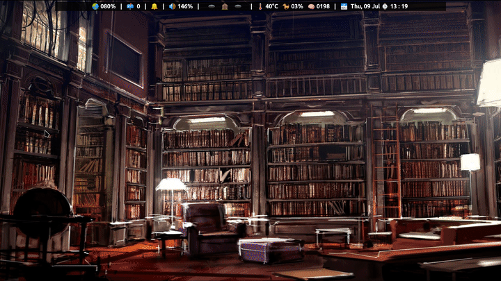

# Devour: Window Manager agnostic swallowing feature for X11

Devour hides your terminal window before launching an external program and unhides it after quitting.  
Devour was inspired by
[sw](https://github.com/ronniedroid/.dotfiles/blob/master/Scripts/sw)
and is a successor to
[devour.sh](https://github.com/salman-abedin/devour.sh)



# Demonstration done by [DistroTube](https://www.youtube.com/channel/UCVls1GmFKf6WlTraIb_IaJg)

[](https://www.youtube.com/watch?v=mBNLzHcUtTo&t=5m22s)

## Dependencies

-  none

## Installation

```sh
git clone https://github.com/salman-abedin/devour.git && cd devour && sudo make install
```

## Usage

```sh
devour CMD/ALIAS ... SAFE FILE ...
devour CMD/ALIAS ... -- SAFE FILE/UNSAFE FILE
```

## Pro Tip

**Devour from your file explorer instead of the shell.**  
Watch my demo and notice how seamless it is compared to devouring from the shell.

**Hint:** If you are one of those unfortunate souls who uses **xdg-open** instead of
[a custom launch script](https://gist.github.com/salman-abedin/6f52c52e465d89d489f9ea8d891c7332),
then go to your **~/.local/share/applications** directory and modify the applications you launch from your file explorer like below and enjoy the true devouring experience.

```
[Desktop Entry]
Type=Application
Name=PDF Reader
Exec=/usr/local/bin/devour /usr/bin/zathura %U
```

## Uninstallation

```sh
sudo make uninstall
```

## Patches

-  **21/06/20**:- Added support for names with spaces

-  **07/07/20**:- Added support for shell aliases

-  **24/07/20**:- Added support for names with spaces in alias mode

-  **03/08/20**:- Rewrote the shellscript in C

## Contributors

-  [agnipau](https://github.com/agnipau)

-  [HawaiinPizza](https://github.com/HawaiinPizza)

-  [sbuller](https://github.com/sbuller)

-  [AriaMoradi](https://github.com/AriaMoradi)

-  [durcor](https://github.com/durcor)

## TO-DOs

-  Authentic swallowing

---

## Repos you might be interested in

| Name                                                    | Description                     |
| ------------------------------------------------------- | ------------------------------- |
| [bolt](https://github.com/salman-abedin/bolt)           | The launcher wrapper            |
| [uniblocks](https://github.com/salman-abedin/uniblocks) | The status bar wrapper          |
| [tide](https://github.com/salman-abedin/tide)           | Minimal Transmission CLI client |
| [puri](https://github.com/salman-abedin/puri)           | Minimal URL launcher            |
| [crystal](https://github.com/salman-abedin/crystal)     | The transparent setup           |
| [Magpie](https://github.com/salman-abedin/magpie)       | The dotfiles                    |
| [Alfred](https://github.com/salman-abedin/alfred)       | The scripts                     |

## Contact

SalmanAbedin@disroot.org
